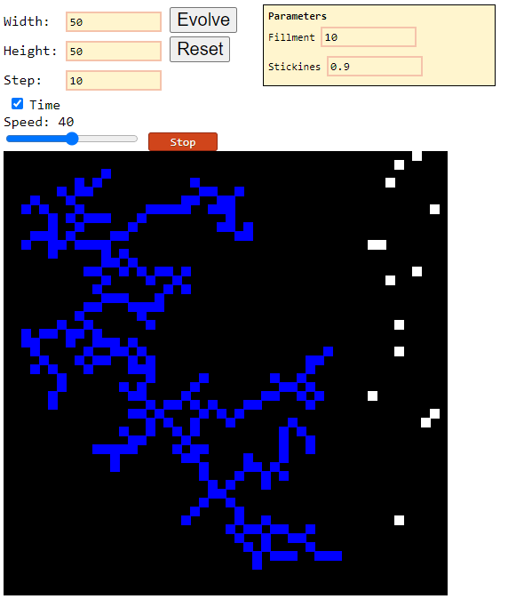
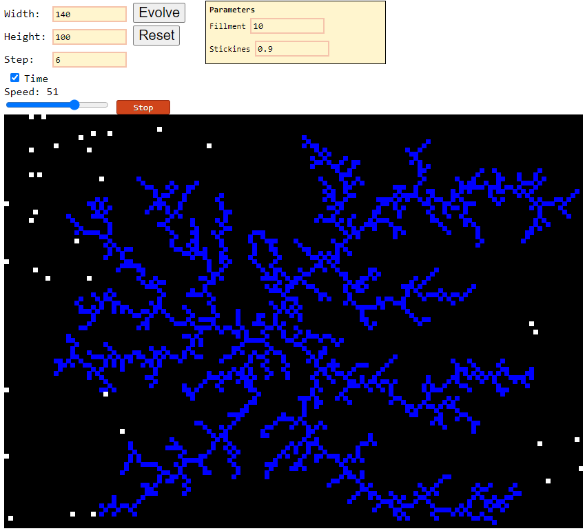

# Diffusion Limited Aggregation

Runtime [DLA](https://en.wikipedia.org/wiki/Maze_generation_algorithm) process visualizer.  
### [Available here (open link)](https://alordash.github.io/DLA/static/index.html)

Animations included.  
This project uses [p5](https://p5js.org/).
